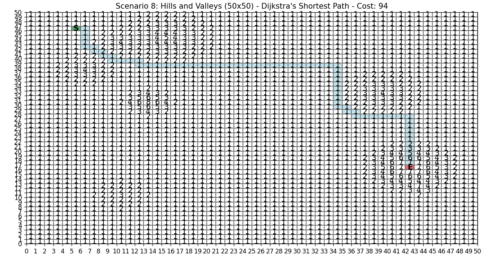

# Dijkstra's Algorithm Visualization

A Python application that visualizes Dijkstra's algorithm for finding optimal paths through various terrain scenarios.



## Overview

This project demonstrates how Dijkstra's algorithm (with a slight A* heuristic) can find the shortest path between two points in a weighted grid. The grid represents terrain where each cell has a "weight" or "cost" to traverse.

## Features

- **Interactive Visualization**: Navigate between different terrain scenarios
- **Optimal Pathfinding**: Uses Dijkstra's algorithm with a directional heuristic
- **Custom Terrains**: Easily create and add your own terrain scenarios
- **Path Analysis**: View path length and total cost information

## Terrain Types

The application includes several pre-defined terrain scenarios:

1. **Uniform Grid**: A simple 10x10 grid with uniform weights
2. **Random Weights**: A 10x10 grid with randomly assigned weights
3. **Diagonal Path**: A grid with a low-weight diagonal path
4. **Two Mountains**: Navigate around or between two mountain ranges
5. **Passable Mountain**: A scenario where crossing over a mountain is optimal
6. **Impassable Mountain**: A scenario where going around a mountain is optimal
7. **Edge Path**: A grid where the optimal path follows the edges
8. **Hills and Valleys**: A complex terrain with various elevations
9. **River and Mountain**: Navigate through a landscape with a river and mountain range
10. **Complex Terrain**: A large scenario with roads, forests, mountains, and a lake

## How It Works

### Dijkstra's Algorithm with Heuristic

The application uses a modified version of Dijkstra's algorithm that includes a small heuristic component to prefer more direct paths. The algorithm:

1. Maintains a priority queue of nodes to visit
2. Explores nodes in order of increasing cost + heuristic value
3. For each node, considers moves in the four cardinal directions
4. Tracks the optimal path and total cost to each visited node
5. Terminates when the destination is reached or all reachable nodes are explored

The heuristic component uses Manhattan distance to guide the search toward the goal, making paths more direct and natural-looking.

### Terrain Representation

Terrains are represented as 2D grids where each cell has a weight:
- Lower weights (1-3): Easy terrain like roads or flat ground
- Medium weights (4-6): Moderate terrain like hills or forests
- Higher weights (7+): Difficult terrain like mountains or water

## Getting Started

### Prerequisites

- Python 3.6+
- matplotlib
- numpy

### Installation

1. Clone the repository:
   ```
   git clone https://github.com/yourusername/Dijkstra_Pathfinding.git
   cd Dijkstra_Pathfinding
   ```

2. Install dependencies:
   ```
   pip install matplotlib numpy
   ```

3. Run the application:
   ```
   python main.py
   ```

### Creating Custom Terrains

To create your own terrain scenario:

1. Create a new Python file in the `terrain` directory (e.g., `terrain/my_terrain.py`)
2. Define a `get_scenario()` function that returns a dictionary with:
   - `name`: A descriptive name for the terrain
   - `grid`: A 2D list of weights
   - `start`: Starting coordinates as (row, col)
   - `end`: Ending coordinates as (row, col)

Example:

```python
def get_scenario():
    size = 20
    grid = [[3 for _ in range(size)] for _ in range(size)]
    
    # Create a mountain in the center
    for i in range(8, 12):
        for j in range(8, 12):
            grid[i][j] = 8
    
    # Create a low-weight path around the mountain
    for i in range(size):
        grid[5][i] = 1
    
    return {
        "name": "My Custom Terrain",
        "grid": grid,
        "start": (5, 0),
        "end": (5, 19)
    }
```

## Understanding the Visualization

- **White cells**: Normal terrain
- **Blue cells**: The calculated optimal path
- **Green cell (S)**: Starting point
- **Red cell (E)**: Ending point
- **Numbers**: Terrain weights/costs

## Algorithm Details

The pathfinding algorithm uses a combination of Dijkstra's algorithm and a small heuristic component:

```python
def dijkstra_shortest_path(grid, start, end):
    # Priority queue for (cost + heuristic, cost, position, path)
    pq = [(heuristic(start), 0, start, [start])]
    visited = set()
    
    while pq:
        _, cost, current, path = heapq.heappop(pq)
        
        if current == end:
            return path, cost
        
        if current in visited:
            continue
            
        visited.add(current)
        
        # Explore neighbors
        for neighbor in get_neighbors(current, grid):
            if neighbor not in visited:
                new_cost = cost + grid[neighbor[0]][neighbor[1]]
                priority = new_cost + heuristic(neighbor)
                heapq.heappush(pq, (priority, new_cost, neighbor, path + [neighbor]))
    
    return None, float('inf')
```